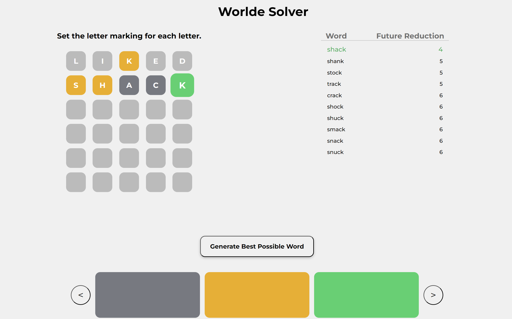

# Worlde Solver Website Made Using React

A worlde solver website. The application takes in inputs for the word you've used, and the word markings given, it then outputs the best possible word that you should choose as your next choice.

The algorithm used to decide the next best possible word factors compares each possible word with every other possible word to score the word. The 10 words with the lowest score (the lower the score, the more useful the word will be in reducing the list of possible words in the future) is then shown to the user.

Created using React.

